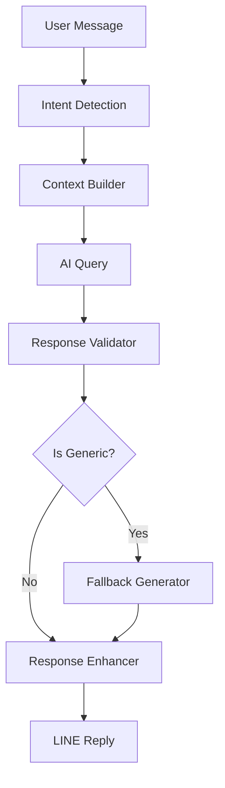

# Design Document

## Overview

The Carda workflow redesign focuses on eliminating generic responses and providing specific, actionable credit card recommendations. The solution involves enhancing the response generation logic, improving the card database, and implementing better generic response detection.

## Architecture

### Current Workflow Analysis
The existing workflow has these key components:
1. Intent Detection → Context Building → AI Query → Response Generation → LINE Reply
2. The main issue is in the "Adaptive Response Generator" node where generic responses aren't properly filtered

### Enhanced Architecture


## Components and Interfaces

### 1. Enhanced Generic Response Detection
**Purpose:** Identify and replace generic AI responses with specific recommendations

**Key Improvements:**
- More aggressive pattern matching for generic phrases
- Length-based detection (responses > 200 chars with multiple cards)
- Vague language detection ("可以考慮", "表現突出")
- Force specific recommendations when generic patterns detected

### 2. Improved Card Database
**Purpose:** Provide accurate, up-to-date card information for recommendations

**Enhanced Features:**
- Specific store matching (7-11, 家樂福, momo, PChome)
- Detailed cashback rates by category
- Current promotional offers
- Target audience matching
- Application requirements

### 3. Smart Recommendation Engine
**Purpose:** Generate specific, personalized card recommendations

**Logic Flow:**
1. Analyze user message for specific requirements
2. Match against card database with weighted scoring
3. Select single best-match card
4. Generate focused recommendation with specific benefits
5. Include promotional offers if available

### 4. Context-Aware Response Generation
**Purpose:** Handle follow-up questions and maintain conversation continuity

**Features:**
- Reference resolution ("那張卡", "這個")
- Conversation history integration
- Comparison handling
- Progressive disclosure of information

## Data Models

### Enhanced Card Data Structure
```javascript
{
  cardId: 'taiwan_gogo',
  name: '台新@GoGo卡',
  bank: '台新銀行',
  annualFee: 0,
  cashbackRates: {
    supermarket: 3,      // 超市/便利商店
    dining: 3,           // 餐廳
    overseas: 2.8,       // 海外消費
    digital: 3.8,        // 數位通路
    online: 5,           // 網購
    general: 1           // 一般消費
  },
  specificStores: {
    '7-11': 3,
    '家樂福': 3,
    'momo': 5,
    'PChome': 5
  },
  benefits: [
    '永久免年費',
    '數位通路高回饋',
    '超市量販3%回饋'
  ],
  targetAudience: ['數位原生', '小資族', '學生'],
  applicationRequirements: {
    minAge: 20,
    minIncome: 0,
    creditScore: 'basic'
  },
  currentPromotions: [
    {
      title: '新戶首刷禮',
      description: '首月刷滿3000元送500元刷卡金',
      endDate: '2025-03-31'
    }
  ]
}
```

### Response Quality Metrics
```javascript
{
  isGeneric: boolean,
  hasSpecificCard: boolean,
  includesBenefits: boolean,
  includesRates: boolean,
  responseLength: number,
  confidenceScore: number
}
```

## Error Handling

### Generic Response Detection
1. **Pattern Matching:** Detect phrases like "可以考慮以下幾張", "表現突出的選擇"
2. **Multiple Card Detection:** Flag responses mentioning 2+ cards without specifics
3. **Length Analysis:** Flag long responses (>200 chars) without specific benefits
4. **Vague Language:** Detect non-specific terms without concrete information

### Fallback Strategy
1. **Primary Fallback:** Use card database to generate specific recommendation
2. **Secondary Fallback:** Provide top-rated card for user's region
3. **Error Fallback:** Ask clarifying questions with examples

### Response Enhancement
1. **Specificity Check:** Ensure response includes card name, specific benefits, rates
2. **Relevance Validation:** Match recommendation to user's stated needs
3. **Completeness Verification:** Include key information (annual fee, cashback rate)

## Testing Strategy

### Unit Testing
- Generic response detection accuracy
- Card matching algorithm precision
- Context resolution functionality
- Response quality scoring

### Integration Testing
- End-to-end workflow execution
- AI service integration
- Database query performance
- LINE message formatting

### User Acceptance Testing
- Response relevance and specificity
- Conversation flow continuity
- Error handling effectiveness
- User satisfaction metrics

### Performance Testing
- Response generation speed
- Database query optimization
- Memory usage during context building
- Concurrent user handling

## Implementation Approach

### Phase 1: Response Validation Enhancement
- Implement aggressive generic response detection
- Add fallback recommendation generation
- Enhance card database with specific store data

### Phase 2: Context Improvement
- Improve reference resolution
- Enhance conversation history usage
- Add comparison handling logic

### Phase 3: Quality Assurance
- Add response quality metrics
- Implement A/B testing framework
- Add user feedback collection

### Phase 4: Optimization
- Performance tuning
- Response caching
- Predictive recommendation loading