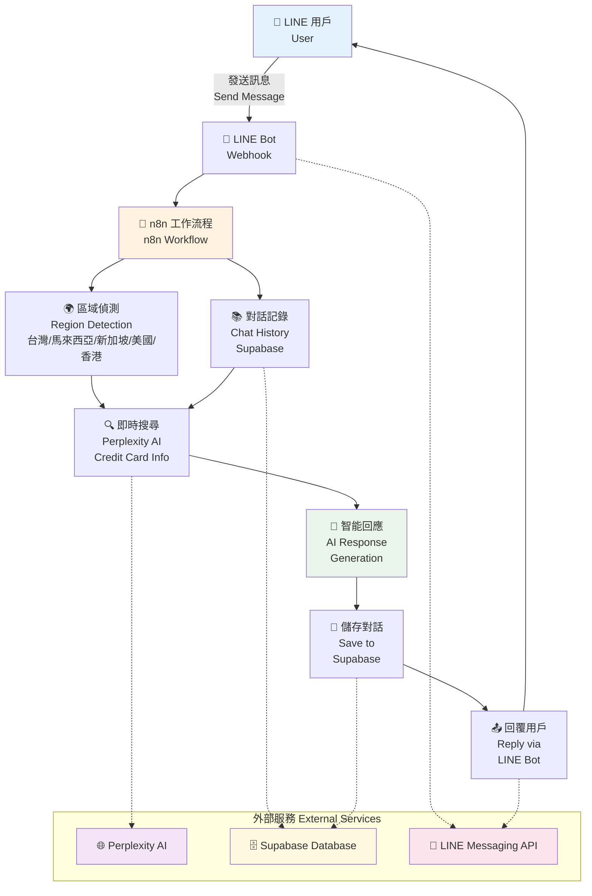

# Carda - AI Credit Card Recommendation Chatbot

An intelligent LINE chatbot that provides personalized credit card recommendations for users in Taiwan and other regions. Built with n8n, integrated with Perplexity AI for real-time credit card information, and uses Supabase for conversation history management.

## 🌟 Features

- **Multi-Region Support**: Supports Taiwan, Malaysia, Singapore, USA, and Hong Kong
- **Intelligent Conversation**: Context-aware responses with conversation memory
- **Real-time Information**: Uses Perplexity AI for up-to-date credit card data
- **LINE Integration**: Seamless communication through LINE Bot
- **Conversation History**: Persistent chat history with Supabase
- **Smart Region Detection**: Automatically detects user region from message content
- **Loading Indicators**: Shows typing indicators during processing
- **Enhanced Response Quality**: Advanced generic response detection and specific card recommendations
- **Store-Specific Matching**: Precise recommendations for 7-11, 家樂福, momo, PChome and other merchants
- **Fallback Recommendation Engine**: Intelligent fallback system that generates specific card recommendations when AI responses are generic
- **Adaptive User Experience**: Different response styles for beginner vs expert users
- **Enhanced Card Database**: Comprehensive card information with specific store cashback rates and promotional offers
- **Smart Card Matching**: Multi-tier matching algorithm that considers store preferences, spending categories, and user demographics

## 🏗️ System Architecture

Built with n8n automation platform integrating:
- **LINE Bot API**: User messaging interface  
- **Perplexity AI**: Real-time credit card search
- **Supabase**: Conversation history storage

## 🤖 Supported Conversation Types

### Greetings
- "嗨", "你好", "Hello"
- Responds with welcome message

### Credit Card Inquiries
- **7-11 Specific**: "7-11信用卡推薦"
- **Best Rewards**: "哪張卡回饋最高"
- **Bank Specific**: "國泰信用卡怎麼樣"
- **Comparisons**: "比較這些信用卡"

### Region Detection
The system automatically detects user region based on keywords:
- **Taiwan**: Default region
- **Malaysia**: "馬來西亞", "CIMB", "Maybank"
- **Singapore**: "新加坡", "DBS", "OCBC", "UOB"
- **USA**: "美國", "Chase", "Citi", "American Express"
- **Hong Kong**: "香港", "恒生", "HSBC"

## 📊 How It Works

1. User sends message via LINE
2. System detects user's region automatically  
3. Retrieves conversation history for context
4. **Advanced Intent Detection**: Analyzes user message patterns and complexity
5. **Smart Card Matching**: Uses multi-tier algorithm to find best matching cards
6. Searches for real-time credit card information via Perplexity AI
7. **Fallback Recommendation**: Generates specific recommendations if AI response is generic
8. **Adaptive Response**: Tailors response style based on user experience level
9. Saves conversation and sends personalized reply back to user

## 🔧 Recent Improvements

### Enhanced Generic Response Detection (Task 1)
- **Aggressive Pattern Matching**: Detects and prevents generic responses like "可以考慮以下幾張", "表現突出的選擇"
- **Quality Assurance**: Ensures all responses contain specific card recommendations with concrete benefits
- **Response Validation**: Multi-layer validation to catch vague language patterns

### Enhanced Card Database (Task 2)  
- **Comprehensive Card Data**: Detailed information for Taiwan's major credit cards
- **Store-Specific Rates**: Precise cashback rates for 7-11, 家樂福, momo, PChome, 全聯, 好市多
- **Promotional Offers**: Real-time promotional campaigns and limited-time offers
- **Application Requirements**: Detailed eligibility criteria and income requirements

### Enhanced Card Matching Algorithm (Task 3)
- **Weighted Scoring System**: Prioritizes exact store matches, then categories, then general features
- **Multi-Tier Logic**: Store-specific → Category-based → Target audience → Fallback strategies
- **Smart Aliases**: Recognizes alternative names and synonyms for stores and categories
- **Contextual Understanding**: Considers user demographics and spending patterns

### Fallback Recommendation Generator (Task 4)
- **Experience Level Detection**: Automatically identifies beginner vs expert users
- **Adaptive Response Styles**: 
  - **Beginner**: Simple format with educational explanations
  - **Expert**: Detailed analysis with comprehensive technical information
- **Intelligent Card Selection**: Multi-priority matching with robust fallback logic
- **Targeted Explanations**: Generates explanations specifically matched to user requirements

## 📱 How to Use

### Find the Bot on LINE
Add the bot on LINE: **@952ohxih**

### Usage Examples

**User**: "7-11回饋最高的信用卡是哪張？"
**Bot**: *Searches for 7-11 credit card rewards and provides current recommendations*

**User**: "比較國泰和中信的信用卡"
**Bot**: *Provides detailed comparison of specified bank credit cards*

**User**: "我是馬來西亞人，推薦信用卡"
**Bot**: *Automatically detects Malaysia region and provides local credit card recommendations*

## 🐛 回報問題 / Report Issues

如果您在使用過程中遇到任何問題，歡迎在此 GitHub Repository 建立 Issue 回報！

If you encounter any issues while using the bot, please create an Issue in this GitHub Repository!

- 🔗 回報問題 / Report Issue: [Create New Issue](https://github.com/lawrencechen0921/Carda/issues/new)
- 📧 聯絡 / Contact: 透過 LINE Bot @952ohxih

## 🤝 意見回饋 / Feedback

我們歡迎任何改善建議！請透過 GitHub Issues 分享您的想法。

We welcome any suggestions for improvement! Please share your ideas via GitHub Issues.
